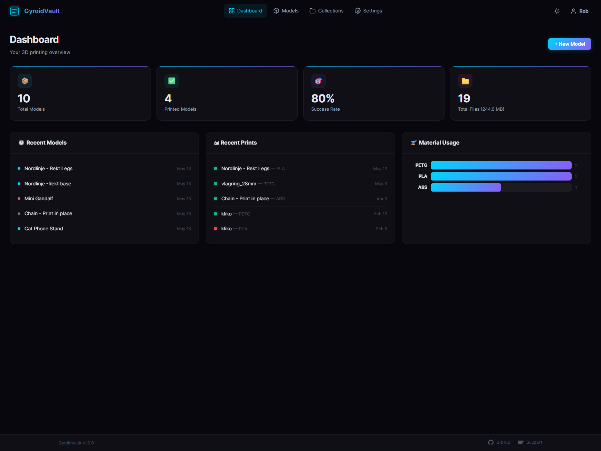
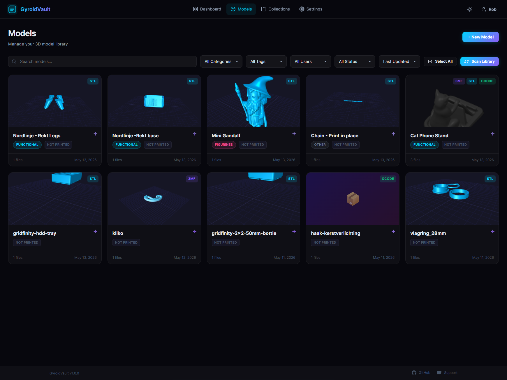
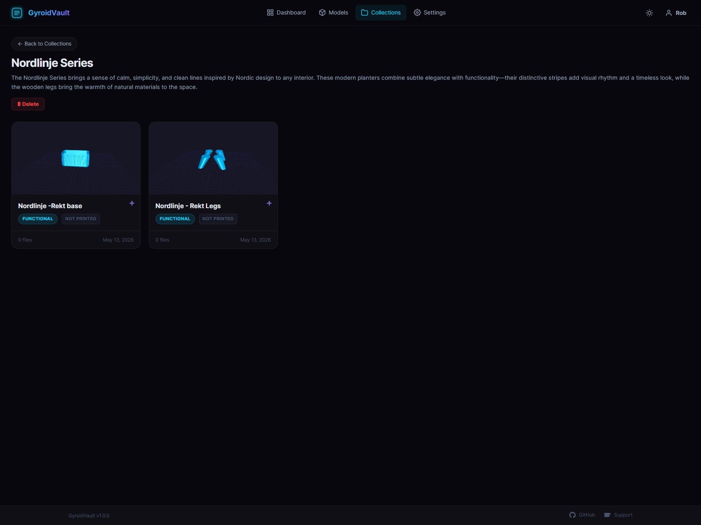
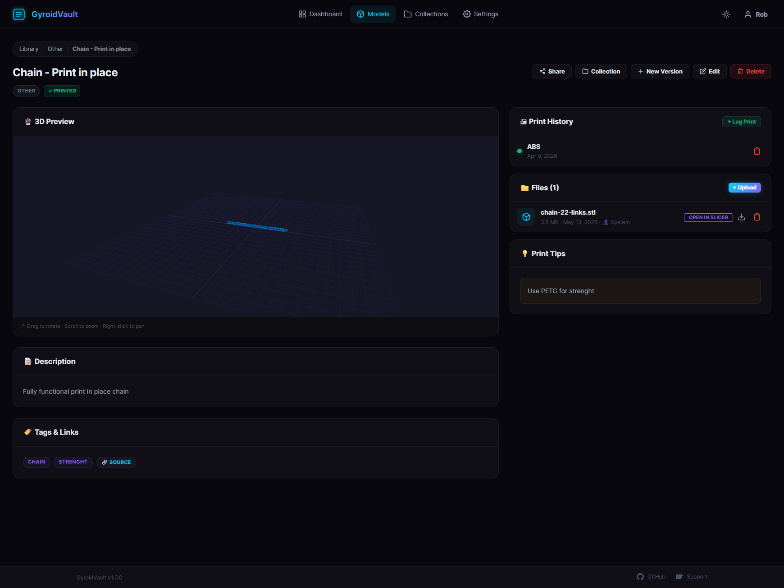

**Small issue** 17-05-2026: currently there is an issue creating the first user. A update will be released this weekend 


# 🗄️ GyroidVault

**GyroidVault** is a modern, self-hosted 3D model library and print management platform designed for enthusiasts and professionals. Organize your STL, 3MF, and Gcode files, track your print history, and manage your projects in a beautiful, responsive dashboard.



## 📸 Gallery

<table style="border: none; border-collapse: collapse;">
  <tr>
    <td style="padding: 5px; border: none;"></td>
    <td style="padding: 5px; border: none;"></td>
  </tr>
  <tr>
    <td style="padding: 5px; border: none;"></td>
    <td style="padding: 5px; border: none;"></td>
  </tr>
</table>

## ✨ Features

- **🌓 Theme Support**: Seamlessly toggle between a sleek dark mode and a crisp light mode.
- **⚡️ Batch Operations**: Select multiple models to move, delete, or add to collections in one go.
- **📂 Smart Library**: Automatic background scanning of your local folders or manual web-based uploads.
- **🔮 Interactive 3D Viewer**: High-performance STL and 3MF preview directly in your browser.
- **🏗 Project Collections**: Group related models together for complex, multi-part builds.
- **🔄 Design Iterations**: Keep track of versioning (v1, v2, v3) under a single model entry.
- **🖨 Print History Log**: Track material usage, print times, and success rates.
- **🔗 Secure Public Sharing**: Generate temporary, secure links to share specific models with others.
- **🔌 One-Click Slicing**: Open files directly in **Bambu Studio**, **PrusaSlicer**, **OrcaSlicer**, or **Elegoo Slicer**.
- **🔑 User Management**: Role-based access control (Admin/User) to keep your vault private.
- **🎨 Premium Aesthetics**: Sleek dark mode interface with glassmorphism and smooth animations.

## 🚀 Quick Start (Docker Compose)

The fastest way to get GyroidVault up and running is using Docker Compose. You don't even need to clone the repository!

1. **Create a file** named `docker-compose.yml`:
    ```yaml
    services:
      gyroidvault:
        image: ghcr.io/teecodedev/gyroidvault:latest
        container_name: gyroidvault
        ports:
          - "3457:3000"
        volumes:
          - ./data:/app/data
          - /path/to/your/3dprints:/library
        environment:
          - NODE_ENV=production
          - PORT=3000
          - LIBRARY_PATH=/library
        restart: unless-stopped
    ```

2. **Configure your library**: Replace `/path/to/your/3dprints` with the actual path on your host machine where your models are stored.

3. **Start the application**:
    ```bash
    docker-compose up -d
    ```

4. **Access GyroidVault**:
    Open [http://localhost:3457](http://localhost:3457) in your browser.

## ⚙️ Initial Setup

### 1. Registering the Admin
The very first person to register on a new GyroidVault instance **automatically becomes the Administrator**.
- You do **not** need an invite code for the first registration.
- If you are prompted for an invite code on a fresh install, ensure your `./data` directory is empty.

### 2. Configuring SMTP (Email)
To enable features like password resets and user invitations, you need to configure SMTP:
1. Log in as the **Administrator**.
2. Go to **Settings** > **SMTP & Mail**.
3. Enter your SMTP server details (Host, Port, User, Password).
4. Save and test the configuration.

## 🛠 Manual Installation

1.  Install [Node.js](https://nodejs.org/) (v18+).
2.  Clone this repo and run `npm install`.
3.  Copy `.env.example` to `.env` and configure your settings.
4.  Run `npm start`.

## 🛡 Security & Privacy

- **SQLite Database**: Your data stays on your hardware. No external cloud database required.
- **Admin Control**: The first registered user automatically becomes the Admin.
- **Encrypted Files**: Files are handled securely and can be managed directly from the UI.

## 🔧 Troubleshooting & Support

### Common Issues
- **Viewer not loading**: Ensure your browser supports WebGL and you are not using an aggressive ad-blocker that might interfere with Three.js.
- **File scanning issues**: Verify that the `LIBRARY_PATH` or the volume mapping in Docker is correct and that the app has read permissions for that directory.
- **Slicer links not opening**: Make sure the slicer (Bambu Studio, etc.) is installed and has registered its URL scheme on your OS.

### Support
- **Unraid Users**: Please use the dedicated support thread on the Unraid Forums.
- **General Issues**: Open an issue on [GitHub Issues](https://github.com/TeeCodeDev/GyroidVault/issues).

## 📜 License

This project is licensed under the **GNU Affero General Public License v3.0 (AGPL-3.0)**. See the [LICENSE](LICENSE) file for details. This ensures that the software remains free and that any improvements made by the community are shared back.

---
*Built with ❤️ for the 3D Printing Community.*
