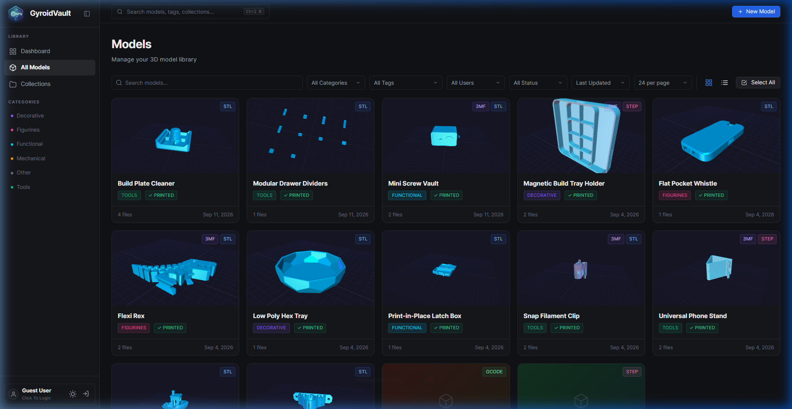
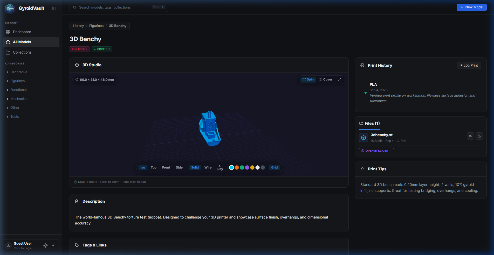
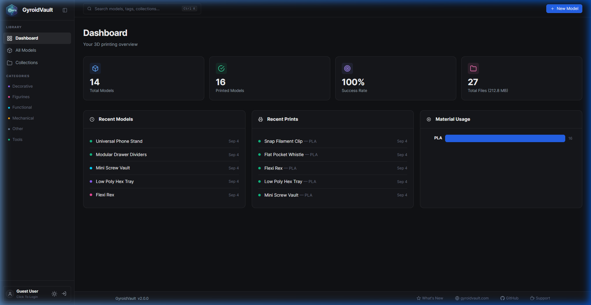

# GyroidVault

[](https://github.com/TeeCodeDev/GyroidVault/releases)
[](LICENSE)
[](https://github.com/TeeCodeDev/GyroidVault/pkgs/container/gyroidvault)
[](https://gyroidvault.com)

**GyroidVault** is a fast, self-hosted 3D model vault and slicing workspace built for 3D printing enthusiasts, makers, and print farm owners. Organize your STL, 3MF, STEP, and G-Code files on your own hardware, inspect multi-part assemblies in a calm 3D studio, measure exact physical dimensions in millimeters, and send slices directly to your printers.

🌐 **Official Website:** [gyroidvault.com](https://gyroidvault.com)  
📖 **Documentation & Wiki:** [GitHub Wiki](https://github.com/TeeCodeDev/GyroidVault/wiki)

---

## What's New in v2.0.0

- 🧩 **Multi-Part 3D Assembly:** Render all STL and 3MF parts together on the virtual build plate in contrasting colors, or inspect them one by one.
- 📐 **Real Physical Dimensions:** See the exact size in millimeters (`W × D × H mm`) right in the 3D header before firing up your slicer.
- ⚡ **Background Scanner for 2TB+ Libraries:** Non-blocking indexing that runs in the background with live progress counters and memory safety guards for giant folders.
- 🎨 **2-Column Studio Workspace:** A clean, distraction-free layout with a full-size 3D viewport, Markdown notes, slicing specs, and print history tabs.
- 📚 **2x2 Collection Collages & 1-Click ZIP:** Visual grid previews for folders and direct ZIP downloads straight to your browser.
- 🛡️ **Under-the-Hood Security:** Stronger access control on private collections, path traversal defenses, parameterized queries, and login rate limiting.
- 🚀 **1-Click Slicer Integration:** Launch models directly into Bambu Studio, PrusaSlicer, OrcaSlicer, or Elegoo Slicer.

---

## Screenshots

<table style="border: none; border-collapse: collapse; width: 100%;">
  <tr>
    <td style="padding: 6px; border: none; width: 50%;">
      
      <p align="center"><em>Library Grid with Dynamic 2x2 Collages & Quick Tags</em></p>
    </td>
    <td style="padding: 6px; border: none; width: 50%;">
      
      <p align="center"><em>Studio 2.0 2-Column Workspace with mm Dimensions</em></p>
    </td>
  </tr>
  <tr>
    <td style="padding: 6px; border: none; width: 50%;">
      
      <p align="center"><em>Interactive 3D Studio with Real-time Filament Swatches</em></p>
    </td>
    <td style="padding: 6px; border: none; width: 50%;">
      
      <p align="center"><em>Dashboard Statistics & Material Usage Tracking</em></p>
    </td>
  </tr>
</table>

---

## Core Features

- **3D Interactive Studio:** Smooth WebGL rendering for STL and 3MF files with isometric presets, wireframe, X-ray inspection, and 1-click thumbnail snapshot generation (`Cover`).
- **Interactive G-Code Previewer:** Inspect toolpaths layer by layer with live layer counts, Z-heights, auto-centered camera framing, and nozzle/bed temperature readouts.
- **Scale Ready for 2TB+ Libraries:** Optimized SQLite indexing and throttled batch disk writes handle tens of thousands of models without UI lag or memory exhaustion.
- **Moonraker & Klipper Integration:** Connect your 3D printers and upload sliced G-Code files straight to your printer with a single click.
- **Power Batch Editing:** `Ctrl+Click` or `Shift+Click` to select dozens of models at once for bulk tagging, category re-assignment, or collection grouping.
- **Folder Watching & Direct Browsing:** Point GyroidVault to your existing 3D print folders on NAS/Unraid shares. It indexes non-destructively without forcing strange directory structures.
- **Duplicate File Finder:** Scans your library with SHA-256 hashes to uncover identical copies eating up drive space.
- **Role-Based Access Control (RBAC):** Admin, Uploader, and Viewer permissions. Keep private collections safe while letting family or team members browse read-only.
- **Expiring Public Share Links:** Generate secure, timed links to share specific models without giving access to your entire library.
- **Custom Metadata Fields:** Add custom key-value pairs (designer, license, print orientation notes, nozzle size) tailored to your workflow.

---

## Quick Start (Docker Compose)

The recommended installation method is using Docker Compose:

```yaml
services:
  gyroidvault:
    image: ghcr.io/teecodedev/gyroidvault:latest
    container_name: gyroidvault
    ports:
      - "3457:3000"
    volumes:
      - ./data:/app/data
      - /path/to/your/3dprints:/library
    environment:
      - NODE_ENV=production
      - PORT=3000
      - LIBRARY_PATH=/library
    restart: unless-stopped
```

1. Replace `/path/to/your/3dprints` with the directory path where your 3D files live.
2. Start the service:
   ```bash
   docker compose up -d
   ```
3. Open your browser and go to `http://localhost:3457` (or your server IP).

> 💡 **Unraid Users:** GyroidVault is available directly in the Unraid Community Applications store. Search for `GyroidVault` to install with pre-configured templates!

---

## Initial Setup

### 1. Register the Administrator
The first user account created on a fresh GyroidVault installation is automatically promoted to **Administrator**. No invite code is required for the initial setup.

### 2. Optional: Configure SMTP Mail
To enable password recovery and email invites:
1. Log in as **Administrator**.
2. Go to **Settings** → **SMTP & Mail**.
3. Fill in your SMTP host, port, credentials, and from-address, then click **Send Test Email**.

### 3. Connect Moonraker / Klipper Printers
1. Go to **Settings** → **Printers**.
2. Add your printer name, Moonraker HTTP URL (e.g., `http://192.168.1.50:7125`), and optional API key.
3. You can now send G-Code files straight to your printer from any model detail page!

---

## Manual Installation (Without Docker)

For running directly on bare metal or custom homelab environments:

```bash
# 1. Clone the repository
git clone https://github.com/TeeCodeDev/GyroidVault.git
cd GyroidVault

# 2. Install dependencies (Node.js 18+ required)
npm install

# 3. Setup configuration
cp .env.example .env

# 4. Start the server
npm start
```

---

## Security & Privacy
 
- **100% Local & Self-Hosted:** Everything lives on your own storage in a lightweight SQLite database. No mandatory cloud accounts, no third-party trackers, no telemetry.
- **Strict Path Confinement:** File reads and uploads stay strictly inside your configured `LIBRARY_PATH` — no directory escaping.
- **Brute-Force Protection:** Rate limiting on logins and sensitive actions. Malicious IPs are temporarily blocked and can be inspected or unblocked from admin settings.
- **Session Tokens & Safe Queries:** Parameterized database queries and securely generated session secrets keep your vault private.

---

## Slicer URL Handlers

GyroidVault supports direct file launching into major slicers via desktop URI protocols:
- **Bambu Studio:** `bambustudio://`
- **PrusaSlicer:** `prusaslicer://`
- **OrcaSlicer:** `orcaslicer://`

Make sure your slicer has URL protocol registration enabled in its system preferences.

---

## Community & Support

- **Bug Reports & Feature Requests:** [GitHub Issues](https://github.com/TeeCodeDev/GyroidVault/issues)
- **Official Documentation:** [GyroidVault Wiki](https://github.com/TeeCodeDev/GyroidVault/wiki)
- **Website:** [gyroidvault.com](https://gyroidvault.com)
- **Support the Project:** If you enjoy using GyroidVault, you can support ongoing maintenance via [Ko-fi](https://ko-fi.com/D1D51ZGUNL).

---

## License

GyroidVault is open-source software licensed under the **GNU Affero General Public License v3.0 (AGPL-3.0)**. See the [LICENSE](LICENSE) file for complete details.
